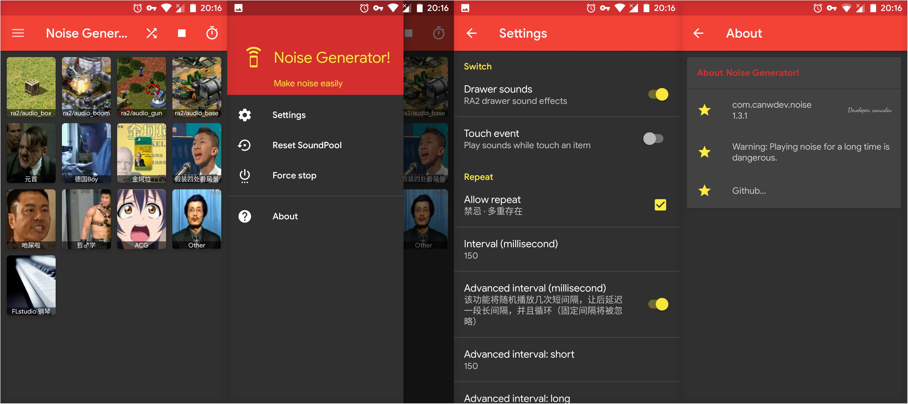

## 噪音产生器 · Noise Generator


“用怎样的节奏抵制寝室的喧闹”

---



---

* minSdkVersion 15
* 本应用遵循 MaterialDesign
* 长时间播放噪音有风险，后果自负。
* 部分素材来自 [GhostAnimalPlayer](https://github.com/CDFLS/GhostAnimalPlayer)

---

### Open Source License

```
GNU GENERAL PUBLIC LICENSE Version 3, 29 June 2007
```